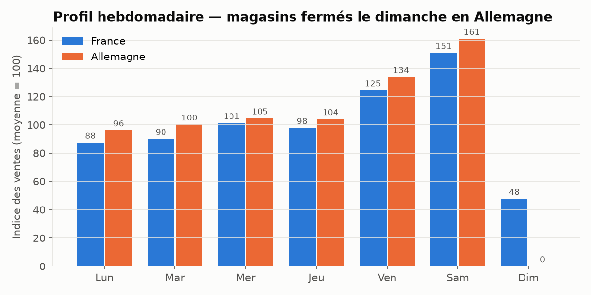
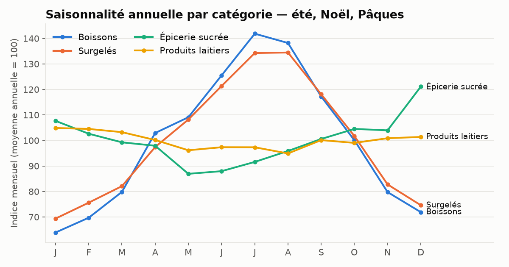
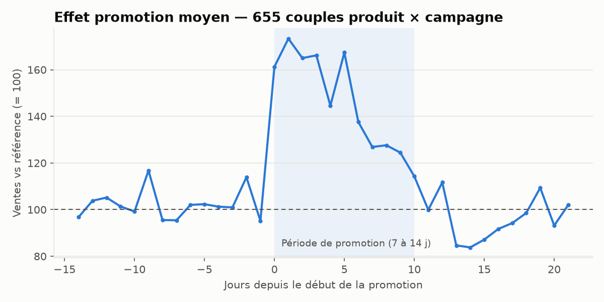
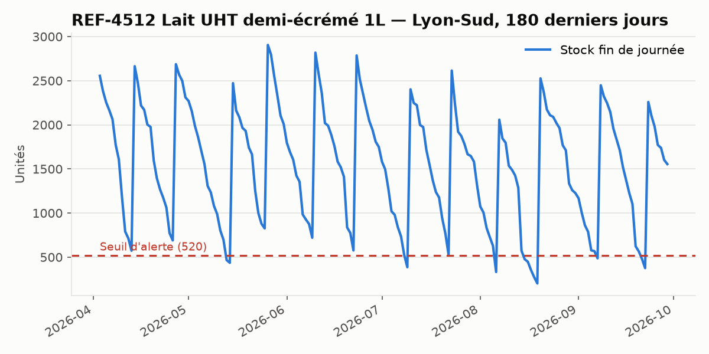

# Données du POC : monde simulé, seed et API sources

Aucune API source réelle n'existe (D-14) : `sources-mock/` simule les trois systèmes sources à partir
d'un **monde déterministe**. Ce document est le contrat entre ce service et le backend.

## Le monde simulé (`sources-mock/app/monde/`)

| Élément | Contenu |
|---|---|
| Période | du 2024-10-01 (`DATE_DEBUT`) jusqu'à **hier** ; le calendrier et les promotions vont jusqu'à aujourd'hui + 120 j |
| Pays | FR (TVA 20 %), DE (TVA 19 %), EUR |
| Entrepôts | FR-LYS Lyon-Sud, FR-PAN Paris-Nord, FR-LIE Lille-Est, DE-BEW Berlin-Ouest, DE-MUE Munich-Est, DE-HAN Hambourg-Nord |
| Produits | 300 produits, 8 catégories, dont les références des maquettes (REF-4512 Lait UHT 1L, REF-8830 Pâtes…) |
| Fournisseurs | 12, délais moyens de 4 à 14 jours |
| Volumes | ~1,14 M lignes de ventes, ~1,31 M relevés de stock, ~35 000 commandes (~83 000 lignes) |

**Déterminisme** : graine fixe (`parametres.GRAINE`). Les données d'un jour ne dépendent que des jours
précédents : toute l'équipe obtient les mêmes chiffres (empreintes SHA-256 identiques), et chaque
nouveau jour s'ajoute sans modifier le passé. `MOCK_DATE_REFERENCE=AAAA-MM-JJ` fige « aujourd'hui ».

### Ce que le modèle de demande contient (à retrouver par le ML, RG-07)

- **Jour de semaine** : pic le samedi (~1,5× la moyenne), dimanche faible en France, **nul en Allemagne** (magasins fermés).
- **Jours fériés** : ventes ×0,3 en France, nulles en Allemagne ; veille de férié ×1,3.
- **Saison annuelle par catégorie** : boissons et surgelés l'été (±30-35 %), épicerie sucrée à Noël (×1,8 du 15 au 24/12) et à Pâques.
- **Vacances scolaires** FR / DE (approximation nationale) : snacking et boissons en hausse.
- **Promotions** : +3 % de ventes par point de remise (25 % → ×1,75), creux de ~15 % les 7 jours suivants.
- **Tendance** : +3 %/an. **Bruit** surdispersé (gamma-Poisson).

Graphiques de contrôle : `docs/donnees/*.png` (régénérer : `cd sources-mock && MOCK_DATE_REFERENCE=2026-09-30 uv run python -m app.graphiques ../docs/donnees`).

### Stocks et commandes

Simulation jour par jour : livraisons reçues → ventes = min(demande, stock) → réassort si
stock + en commande ≤ point de commande. Le réassort anticipe la saison **mais pas les promotions** :
d'où des ruptures réalistes (~3,5 % des couples-jours, taux de service ~96,5 %). Retards fournisseurs,
annulations (1 %) et grèves (7 à 15 jours) perturbent les livraisons.

⚠️ **Ventes censurées** : quand le stock est à zéro, les ventes le sont aussi alors que la demande
existe. Le ML (lot 4) doit en tenir compte (`stock_quotidien` = 0 ⇒ observation non représentative).
⚠️ **Jours sans vente** : les lignes à quantité 0 ne sont ni exportées ni exposées (agrégat
journalier). Une absence de ligne = 0 vente ce jour-là (compléter les séries avant d'entraîner).

## Seed : chargement direct en base (`npm run seed`)

1. `sources-mock` : `python -m app.export /data/seed [--jusqu-a AAAA-MM-JJ]` écrit un CSV **propre**
   par table (colonnes = colonnes de la table) + `manifest.json` (graine, dates, nb de lignes, SHA-256).
2. `backend` : `python -m app.seed /data/seed` vide les données métier puis recharge tout par `COPY`
   en **une transaction** (tout ou rien). Conservés : `utilisateur`, `journal`.

Durée mesurée : ~20 s au total. `--jusqu-a` permet de charger un historique partiel puis de
synchroniser la suite via les API (lot 3). Le seed configure aussi les 3 connecteurs (`source_api`).

## API sources (`http://localhost:8100/docs`)

Authentification : `Authorization: Bearer $SOURCES_API_KEY` (défaut `dev-mock-key`).
Pagination : `page` (≥ 1), `page_size` (≤ 5000) ; réponse `{data, page, page_size, total, pages}`.

| Source | Endpoint | Paramètre | Colonnes mappées → cible | Colonnes à ignorer (RG-01) |
|---|---|---|---|---|
| ERP Ventes | `GET /api/v1/sales` | `date` (≤ hier) | sale_date→date_vente, sku→reference, warehouse_code→code_entrepot, qty→quantite_vendue, unit_price_excl_tax→prix_vente_ht | currency, channel, _ingested_at |
| WMS Stocks | `GET /api/v1/stock-levels` | `date` (≤ hier) | snapshot_date→date_releve, sku→reference, warehouse_code→code_entrepot, on_hand→quantite_stock | unit, bin_location |
| Portail Fournisseurs | `GET /api/v1/purchase-orders` | `modifie_depuis` | po_number→numero_commande, supplier_code→code_fournisseur, warehouse_code→code_entrepot, ordered_at→date_achat, expected_delivery→date_livraison_estimee, delivered_at→date_livraison_reelle, status→statut, sku→reference, qty→quantite_commandee | buyer |

Le mapping est stocké dans `source_api.mapping_colonnes`. Les références (`sku`, codes) sont des clés
naturelles (D-19) que le connecteur résout en identifiants.

**Données salies** (déterministes, ~5 % ventes/stocks, ~2 % commandes) : quantité négative, quantité
non numérique (`"N/A"`), produit inconnu (`REF-0000`), entrepôt inconnu (`XX-INC`), doublon strict.

**Pannes simulées** (UC-03 2a) :
- ponctuelle : `?fail=timeout` (répond 504 après `MOCK_TIMEOUT_SECONDES`, 45 s par défaut), `?fail=500`, `?fail=auth` ;
- permanente : `MOCK_PANNES=purchase-orders=timeout` dans `.env` (parcours 2 : « Portail Fournisseurs » en échec).
